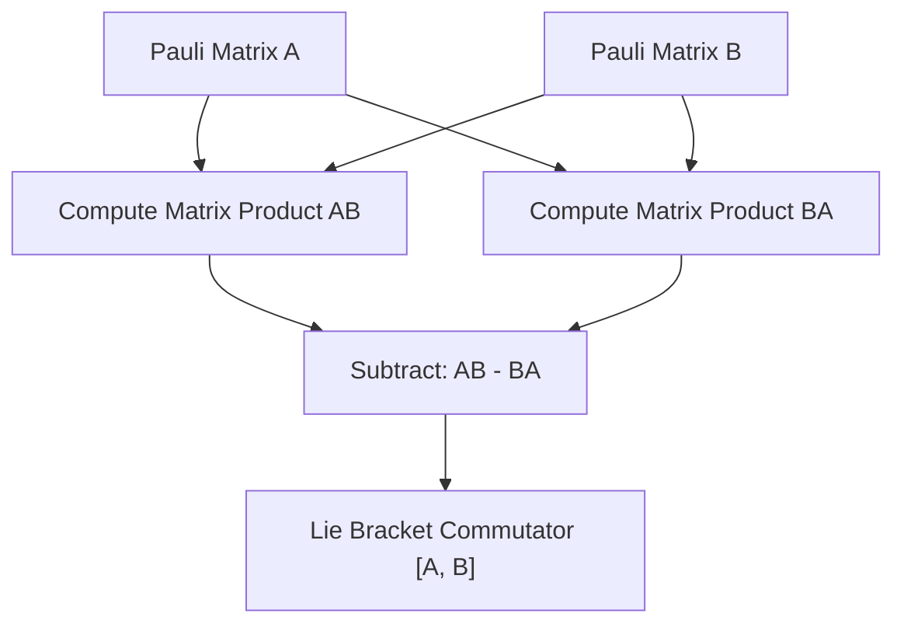

# Pauli Algebra & Commutator Skill

High-efficiency, zero-dependency Python implementation of **Pauli Group Algebra and Commutation Operator Relations**.

## Features
- **Pauli Basis Representation**: Full support for \(\sigma_0, \sigma_x, \sigma_y, \sigma_z\) matrix representations.
- **Commutator Algebra**: Evaluates Lie bracket \([A, B] = AB - BA\) ensuring foundational quantum algebra compliance \([\sigma_j, \sigma_k] = 2i\epsilon_{jkl}\sigma_l\).
- **Zero External Dependencies**: Pure Python standard library.
- **Native MCP Protocol**: JSON-RPC 2.0 stdio server compatible with Claude Desktop, Cursor, and Windsurf.

## Architecture

